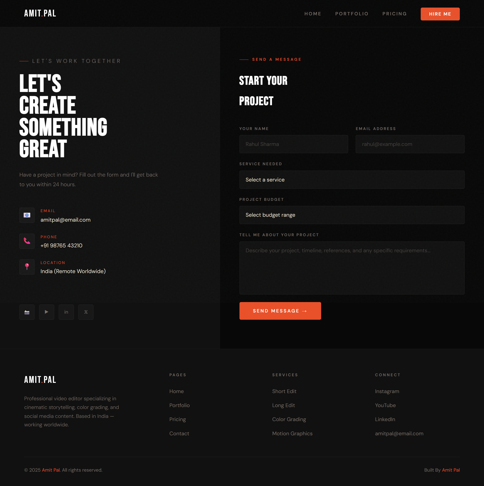

# 🎬 Amit Pal — Video Editor Portfolio Website

> A production-ready, single-file portfolio website for professional video editor **Amit Pal**.  
> Built with pure HTML, CSS, and vanilla JavaScript — no frameworks, no dependencies.

---

## 📋 Table of Contents

- [Live Preview](#live-preview)
- [Features](#features)
- [Pages](#pages)
- [Project Structure](#project-structure)
- [Getting Started](#getting-started)
- [Customization Guide](#customization-guide)
- [Technologies Used](#technologies-used)
- [Browser Support](#browser-support)
- [License](#license)

---

## 🚀 Live Preview

Open `index.html` directly in any modern browser — no server or build step required.

```bash
# Clone or download the project
open index.html    # macOS
start index.html   # Windows
xdg-open index.html  # Linux
```

---

## ✨ Features

### UI & Design
- **Cinematic dark aesthetic** with a signature burnt-orange (`#e8512a`) accent palette
- **Bebas Neue** display font + **DM Sans** body font — distinctive, non-generic pairing
- Animated noise overlay for depth and texture
- CSS custom properties (design tokens) for easy global theming
- Fully responsive — mobile, tablet, and desktop

### Navigation
- Fixed glass-blur navbar with backdrop filter
- Active page highlighting with underline indicator
- Mobile hamburger menu with smooth open/close
- Single-page application (SPA) navigation — zero page reloads

### Interactions & Animations
- Intersection Observer-powered scroll-reveal animations
- Staggered fade-up entrance effects on all sections
- Animated horizontal marquee ticker (tools/skills loop)
- Hover micro-interactions on cards, buttons, and nav links
- Spinning "Scroll to Explore" badge in the hero
- Back-to-top button (appears after 400px scroll)

### Functional Components
- **Portfolio filter** — filter projects by category (Short / Long / Color / Corporate)
- **Pricing toggle** — Monthly vs. Bundle mode with live price recalculation (20% off)
- **FAQ accordion** — smooth open/close with animated icon
- **Contact form** — field validation + success feedback message

---

## 📄 Pages

| Page | Route (JS) | Description |
|------|-----------|-------------|
| **Home** | `home` | Hero, marquee, about strip, services, process, testimonials |
| **Portfolio** | `portfolio` | Filterable project grid with hover overlays |
| **Pricing** | `pricing` | 3-tier pricing cards + FAQ accordion |
| **Contact** | `contact` | Two-column layout with contact info + validated form |

---
## PREVIEW PROJECTS 

# HOME


# PORTFOLIO


# PRICE


# CONTACT

## 📁 Project Structure

```
amit-pal-portfolio/
│
├── index.html          # ← Entire website (HTML + CSS + JS in one file)
├── README.md           # ← This file
│
└── images/             # ← Add your own images here
    ├── image1.jpg      # Hero background
    ├── image2.jpg      # Short Edit service card
    ├── image3.jpg      # Long Edit service card
    └── about.jpg       # About section photo
```

> **Note:** The website works without images — placeholder gradients are shown automatically when image files are missing.

---

## 🛠️ Getting Started

### 1. Download the Files

```bash
git clone https://github.com/Amitpal261/Editing-Website.git
cd EDITING-WEBSITE
```

Or simply download `index.html` and open it in your browser.

### 2. Add Your Images

Place your images in an `images/` folder next to `index.html`.  
Then update the CSS variables inside `<style>` to point to them:

```css
/* Hero background image */
.hero-bg {
  background-image: url('images/image1.jpg'), linear-gradient(...);
}

/* About section photo */
.about-img {
  background-image: url('images/about.jpg');
}
```

### 3. Customize Your Info

Search and replace the placeholder text in `index.html`:

| Placeholder | Replace With |
|-------------|-------------|
| `amitpal@email.com` | Your real email address |
| `+91 98765 43210` | Your phone number |
| `India (Remote Worldwide)` | Your actual location |
| `50+` (projects) | Your actual project count |
| `4+` (years) | Your actual years of experience |

---

## 🎨 Customization Guide

### Changing the Accent Color

All colors are defined as CSS variables at the top of the `<style>` block. Change one line to retheme the whole site:

```css
:root {
  --accent:  #e8512a;   /* ← Main brand color (buttons, highlights) */
  --accent2: #f5a623;   /* ← Secondary accent (hero italic, price tags) */
  --bg:      #080808;   /* ← Page background */
  --surface: #111111;   /* ← Card/section backgrounds */
  --text:    #e8e0d4;   /* ← Body text */
  --muted:   #7a7069;   /* ← Secondary/muted text */
}
```

### Changing Fonts

Fonts are loaded from Google Fonts at the top of `<head>`. Replace the `@import` URL and the CSS variables:

```css
:root {
  --font-head: 'Bebas Neue', sans-serif;  /* Display / headings */
  --font-body: 'DM Sans', sans-serif;     /* Body / UI text */
  --font-ital: 'Playfair Display', serif; /* Italic accent */
}
```

### Adding Portfolio Projects

Edit the `projects` array in the `<script>` block:

```javascript
const projects = [
  { title: 'Your Project Title', cat: 'short', color: '#1a0d08',type:"landscape" },
  { title: 'Another Project',    cat: 'long',  color: '#081520',type :"portrait" },
  // Add more...
];
```

**Valid categories:** `short` · `long` · `color` · `corporate`

### Updating Pricing

Edit the `basePrices` object and the pricing card HTML directly:

```javascript
const basePrices = { p1: 499, p2: 2999, p3: 5999 };
```

Bundle pricing (20% off) is calculated automatically.

### Editing the FAQ

Update the `faqs` array in the `<script>` block:

```javascript
const faqs = [
  { q: 'Your question here?', a: 'Your answer here.' },
  // Add or remove items...
];
```

### Updating Testimonials

Find the `.testimonials-grid` section in the HTML and edit each `.testimonial-card` block with real client names, roles, and feedback.

---

## 🧰 Technologies Used

| Technology | Purpose |
|------------|---------|
| **HTML5** | Semantic page structure |
| **CSS3** | Styling, animations, layout (Grid + Flexbox) |
| **Vanilla JavaScript (ES6+)** | SPA navigation, filtering, FAQ, form logic |
| **Google Fonts** | Bebas Neue · DM Sans · Playfair Display |
| **CSS Custom Properties** | Design token system for easy theming |
| **Intersection Observer API** | Scroll-triggered reveal animations |
| **CSS Animations** | Marquee, spin, fade-up, hover effects |

**Zero dependencies.** No npm. No build tool. No framework. Just open and use.

---

## 🌐 Browser Support

| Browser | Support |
|---------|---------|
| Chrome 88+ | ✅ Full |
| Firefox 85+ | ✅ Full |
| Safari 14+ | ✅ Full |
| Edge 88+ | ✅ Full |
| IE 11 | ❌ Not supported |

> `backdrop-filter` (glass navbar blur) requires Chrome 76+, Safari 9+, or Firefox 103+.  
> Falls back gracefully to a solid dark background on older browsers.

---

## 📦 Deployment

Since this is a static site, you can host it anywhere for free:

| Platform | How to Deploy |
|----------|--------------|
| **GitHub Pages** | Push to a repo → Settings → Pages → Deploy from `main` branch |
| **Netlify** | Drag & drop the project folder at [netlify.com/drop](https://netlify.com/drop) |
| **Vercel** | `npx vercel` in the project directory |
| **Cloudflare Pages** | Connect your GitHub repo in the Cloudflare dashboard |

No build command or output directory needed — just point to `index.html`.

---

## 📝 Connecting a Real Contact Form

The contact form currently shows a success message client-side only. To receive real emails, integrate a free form service:

**Option 1 — Formspree (easiest):**
```html
<!-- Replace the onclick with a real form action -->
<form action="https://formspree.io/f/YOUR_FORM_ID" method="POST">
```

**Option 2 — EmailJS (no backend):**
```javascript
emailjs.send('service_id', 'template_id', { name, email, message });
```

**Option 3 — Netlify Forms:**
```html
<form name="contact" netlify>
```

---

## 📄 License

This project is created for **Amit Pal** personal use.  
Feel free to adapt it for your own portfolio.

---

## 👤 Author

**Amit Pal**  
Professional Video Editor · India  
📧 amitpal@email.com

---

<div align="center">

Made with ❤️ · Pure HTML / CSS / JS · No frameworks

</div>